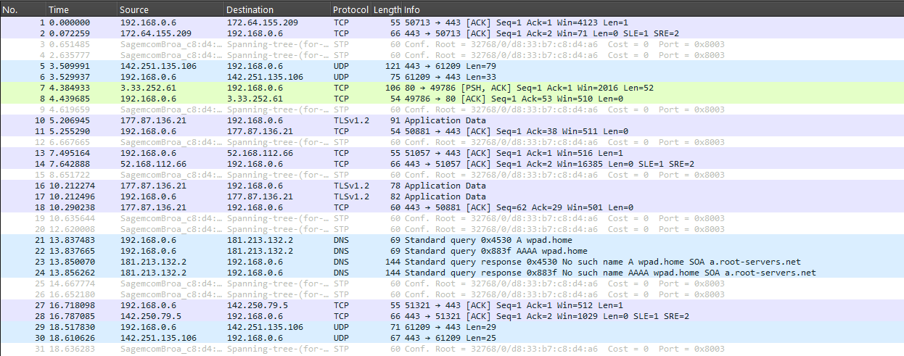
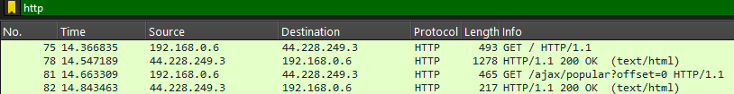
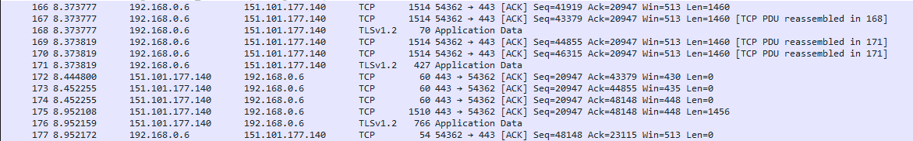
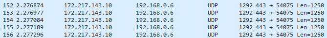
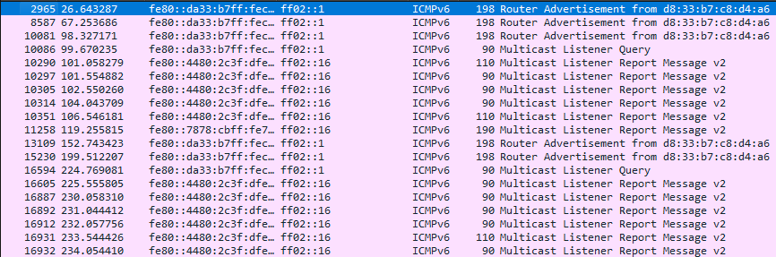
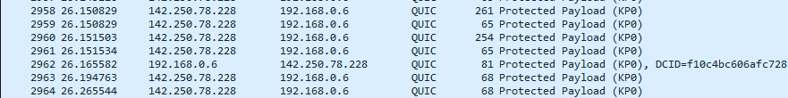

# Captura e analise de pacotes

### Estudar os pactoes capturados com o wireshark

#### Pacotes: 1, 2, 10, 11, 12, 16, 17, 18

- Pacote 1 → SYN enviado de 192.168.0.6 para 172.64.155.209 na porta 443 (HTTPS), iniciando uma conexão TCP.
- Pacote 2 → SYN-ACK recebido de 172.64.155.209, confirmando a conexão.
- Pacote 10 → Início da negociação TLSv1.2, possivelmente para uma conexão segura com um site.
- Pacote 11 → Mais pacotes relacionados à negociação TLS.
- Pacote 16-18 → Continuação da troca de dados criptografados sobre a conexão TLS.

Aqui acontece uma negociação de uma conexão HTTPS entre o dispositivo (192.168.0.6) e um servidor (172.64.155.209, que pode pertencer à Cloudflare ou outro serviço web).

Os protocolos utilizados são:
- Pacotes 1 e 2 indicam o handshake TCP (estabelecendo a conexão com o servidor).
- Pacotes 10, 16, 17 e 18 usam TLS 1.2, o que confirma que a comunicação com o site é criptografada (HTTPS).
- Pacotes 11 e 12 são pacotes intermediários da conexão TCP, transportando os dados criptografados.

### Pacotes capturados em uma tentativa de cadastro no site da Pichau(pichau.com.br)
Nos requisitos do trabalho era pedido para
"Criar uma pagina simples de login e senha ou cadastro".
No meu caso eu utilizei uma pagina já existente na internet que foi a pagina de autenticação da pichau

#### Analisando os Campos
- 132 → Número do pacote na captura.
- 2.295085 → Tempo (em segundos) desde o início da captura.
- 192.168.0.6 → Seu dispositivo na rede local.
- 104.20.13.70 → O servidor da Pichau (esse IP pertence à Cloudflare, que protege e acelera sites como o da Pichau).
- QUIC → O protocolo de transporte usado.
- 86 → Tamanho do pacote em bytes.
- Protected Payload (KP0) → O conteúdo do pacote está criptografado.
- DCID=0112baf7ef6e6a32971113f7836e6fc761f9374d → ID da Conexão Destino (Destination Connection ID), usado para identificar a sessão QUIC.

O QUIC (Quick UDP Internet Connections) é um protocolo moderno criado pelo Google para substituir o TCP + TLS. Ele é usado por sites como Google, YouTube, Cloudflare e Pichau para tornar conexões mais rápidas e seguras.

Dessa forma os dados sensíveis são criptografados por esse protocolo e usuários mal intencionados nao conseguirão ler senhas, emails ou outros dados sensiveis sem descriptografar o tráfego (o que é muito difícil sem acesso à chave privada do servidor).

### Analisar pacotes HTTP e HTTPS

Site usado para pacotes http: http://eu.httpbin.org/

Site usado para pacotes https: https://www.reddit.com/

A principal diferença entre os pacotes capturados é o tipo de informação que aparece para leitura. 

Nos pacotes http os dados são transmitidos em texto claro e é possivel ver os metodos http e a resposta do servidor para aquela requisição. 

Por outro lado, em pacotes https onde os dados são criptografados usando TLS a unica informação que aparece é o handshake (processo de negociação entre o cliente e o servidor para estabelecer uma conexão segura)

# Estudo de Redes e Endereçamento IP

### Identificar IP publico e privado
Para distinguir entre IP publico e IP privado, é necessário conhecer os intervalos de endereços IP privados definidos pelas especificações do IPv4

**Intervalos de IP Privado (IPv4):**
- Classe A (10.0.0.0 - 10.255.255.255)
- Classe B (172.16.0.0 - 172.31.255.255)
- Classe C (192.168.0.0 - 192.168.255.255)

O endereço **192.168.0.6** é privado. Ele pertence ao intervalo de endereços IP privados da classe C, que vai de **192.168.0.0** a **192.168.255.255**.

Já o endereço **172.217.143.10** é público. Ele não pertence a nenhum dos intervalos de IPs privados, portanto, é um endereço público e está acessível na internet.

### Conhecer o IPV6
#### IPV6

#### IPV4

**Diferenças:**

- Nos pacotes IPv6, os endereços de origem e destino são endereços IPv6 no formato hexadecimal (ex.: **fe80::da33:b7ff:fec8:d4a6** e **ff02::1**). Enquanto nos pacotes ipv4 os endereços estão no formato decimal(ex.: **142.250.78.228** e **192.168.0.6**)
- O pacote IPv6 usa **ICMPv6** para enviar uma mensagem de Router Advertisement. Este é um tipo específico de mensagem ICMP no IPv6, utilizado para a descoberta de roteadores na rede. Enquanto os pacotes IPv4 usam **QUIC**, que é um protocolo de transporte desenvolvido pelo Google, focado em fornecer conexões seguras e de baixa latência, geralmente usado para serviços como Google Chrome e YouTube.
- O pacote IPv6 não especifica diretamente qual protocolo de transporte foi usado, mas é provável que utilize o **UDP** por ser uma mensagem **ICMPv6**. Enquanto o pacote IPv4 usa **QUIC**, que está em uma camada de transporte superior (similar ao **TCP/UDP**), mas é projetado para ser mais rápido e eficiente em conexões seguras.
    